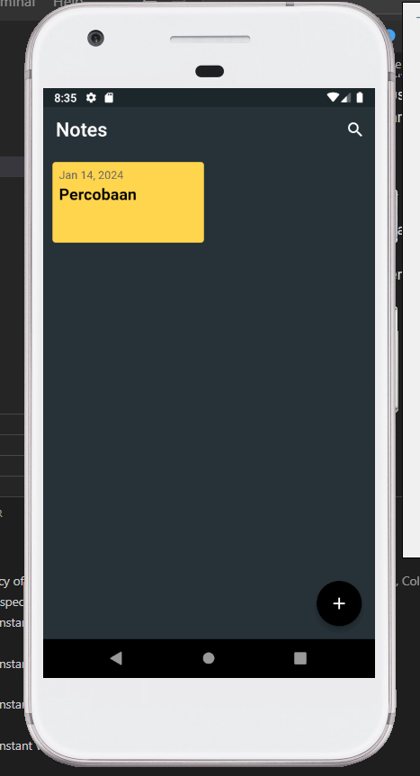
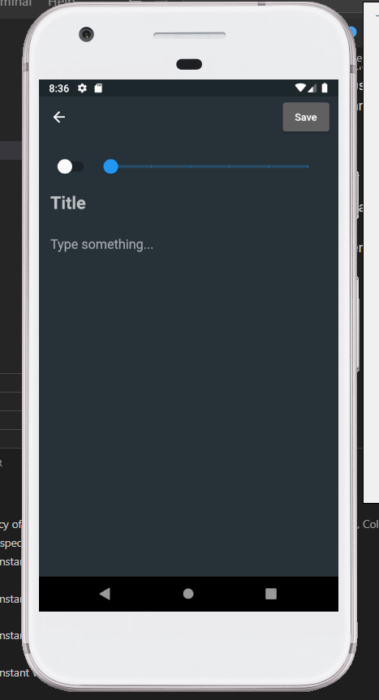
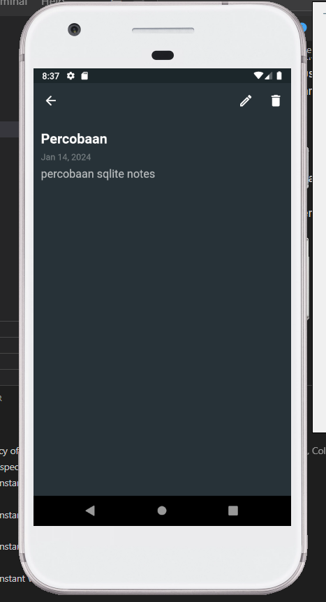
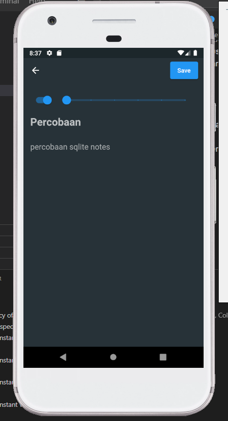

# Projek Flutter Note Taking App

Projek ini adalah aplikasi pencatat catatan yang dibuat dengan Flutter. Aplikasi ini memungkinkan pengguna untuk membuat, mengedit, dan menghapus catatan dengan mudah dan cepat. Semua catatan disimpan secara lokal menggunakan SQLite, sehingga Anda dapat mengakses catatan Anda kapan saja, bahkan tanpa koneksi internet.

## Kontributor

Projek ini dibuat oleh:

1. Naufal Reky Ardhana (4.33.22.0.21)
2. Rachmadandy Mahendra Shakti (4.33.22.0.22)

## Fitur

- Buat catatan baru
- Edit catatan yang ada
- Hapus catatan
- Simpan catatan ke penyimpanan lokal menggunakan SQLite

## Preview

Berikut adalah beberapa screenshot dari aplikasi:

### Halaman Utama

Halaman utama menampilkan daftar semua catatan yang telah dibuat.

### Halaman Tambah Catatan

Halaman ini digunakan untuk membuat catatan baru.

### Halaman Lihat Catatan

Halaman ini menampilkan detail dari sebuah catatan.

### Halaman Edit Catatan

Halaman ini digunakan untuk mengedit catatan yang ada.

## Dependencies

Projek ini menggunakan beberapa dependencies berikut:

- flutter
- cupertino_icons
- sqflite
- path_provider
